ECE 4160

My name is Kofi Ohene Adu (kao65). This page contains the labs I have completed for this course. I am an electrical and computer engineering student, with an interest in robotics and languages. I like video games, playing the guitar, and pretty much like listening to music in general.
Welcome to my Fast Robots page! This is a work in progress!

# Lab 1: Introduction to Artemis 
## Part 1
The objective of this part of the lab is to test Artemis board functionality, by testing the LED, Temperature sensor, Serial output, and microphone.

### "Example 1: Blink it Up"
The “Blink it Up” example was used for this portion of the lab. The code, when compiled would turn the LED on for a specified amount of time, then would turn it off. Below is the result:

*Note: Will take you to the video itself*

### "Example 4: Serial"
This example found under Artemis examples, was used to test the serial monitor output. It would print out any messages that were typed in the input space, as seen in the image below.

*Serial test Image*

### "Example 2: Analog Read"
This example  was used to test the temperature sensor on the Artemis board.  The test would send the temperature reading and time to the serial monitor and would slightly change the temperature number as I applied warm air. ( Change is tiny, about 0.2 from 33.7 to 33.9, likely due to the surrounding room temperature being warmer than usual). Below is the result

*Note: Will take you to the video itself*

### "PDM/Example 1: Microphone Output"
The microphone output example was used to show the frequencies picked up by the Artemis board. There would be a slight change as I released a higher-pitched whistle in time and would decrease as I stopped. Below is an image and video of this:

*Mic test Image*

*Note: Will take you to the video itself*

## Part 2: Bluetooth Setup
The objective of this part of the lab was to establish a Bluetooth connection between the Artemis board and the computer and to indicate its functionality. In this section, we worked in tandem with both Arduino and Python (using Jupiter lab) to connect the Artemis through Bluetooth, then send data to the board over Bluetooth as well

### Prelab
We were tasked with installing the virtual environment that was to be used during the rest of the labs and installing the necessary packages for it. Next was to unzip the codebase to be used during this lab and the later ones also.
Next was to find and change the necessary MAC address and UUIDs for our individual Artemis boards. The change is to be made in the ble_arduino.ino  file in the ble codebase. Since many boards could share the same MAC address, also using their UUIDs is a recommended step. This change would be replicated in the connection.yaml file shown.

*Mac Address*

*UUID*

*Connections in both Arduino and Python files*

### The Connect

*How ble connection is done*

### "ECHO" Command
An ECHO command was to be implemented to test the connection between the computer and the Artemis board. This command would send a character string to the board from the Python code, then when printed, it would send the phrase back to the Python code.

*Echo Implementation*

*Echo results*

*Note:* Whenever a new command was to be created it was to be added to the CommandTypes list. Each command would have an assigned value addressed to it and then we would need to add that command and its value to the cmdtypes file on Jupyter Notebook, as shown below.

###  "GET_TIME_MILLIS" Command
This implementation involved receiving the current time from the Artemis board. This involved using the millis() function to get the current time in milliseconds and then convert it to an int. The result was presented as a string. The implementation is shown below.

### GET_TIME Command

### Notification Handler
The notification handler is used to automatically receive the data sent by the Artemis board without manually calling the data each time.  For the code, I decided to use an array at each initialization of the code so that all the data would be put in an array, whether it was a single value or an assortment of them. This piece of Python code will be very helpful as we create multiple functions to collect data (including those containing arrays)

Whenever the notification handler is being used, it is “told” to collect the data received by calling the start_notify() function as shown below. 

This is done only once for the handler to function. To stop the handler from collecting information, we just issue the stop_notify() command on the Python file 

### "SEND_TIME_DATA" Command
This command was used to get each time reading for 50 seconds. Similar to the GET_TIME_MILLIS command it would get the current time at each iteration of the loop and then put it in a time array to be received by the notification handler. 

### "GET_TEMP_READINGS" Command
This command involved extracting many temperature readings in the span of a few seconds. For this code, I created another array to hold the temperature reading and then appended each value in the array to its corresponding time value. The data was then sent as strings by a for loop to the Python code. This reduced the need to have another command  to send the data just like in the SEDN_TIME_DATA command

### A Limitation
The Artemis Board has a maximum storage of 384 kB of RAM. If we sampled 16-bit values at an average frequency every 50 seconds, we would be able to create about less than 30 values before the storage on the Artemis board would run out. Sending data in groups would thus optimize the speed of data acquisition from the Artemis board.

# Lab 2: IMU 
The goal of this lab was to set up the integration between the Artemis board and the imu to gather the robot's relative angular orientation data (pitch, roll, and yaw). Another step was to enable the Artemis board the ability to send this data over Bluetooth for processing.

### Setup the IMU
First, we hook up the IMU to the board and install the SparkFun 9DOF IMU Breakout - ICM 20948 library onto the Arduino IDE in order to use it with the Artemis.

Next up is running The Example1_BAsics code under the ICM 20948 library to test that our IMU is functioning properly. This is done by rotating the IMU around and checking if the values printed in the Serial Monitor on the Arduino IDE are changing, as shown below:

*Note:* The constant, AD0_VAL, is used to change the last digit of the address for the IMU. There was a data underflow error if the value for AD0_VAL wasn't changed to 0 in my case.

### Accelerometer
The accelerometer is the component of the IMU that is used to find linear acceleration, however, there is a method by which we can calculate the pitch and roll of the robot, using atan2 as shown below:

Where both are found by using their unneeded axes(X and Z for pitch, Y and Z for Roll).

Below is the graph achieved from rotating the IMU between -90 and 90 along the edge of my table

As you can see, our plot has a lot of noise so to fix this, a low pass filter was to be created. I first analyzed the data by transferring it into Fourier Transform format to single out the fundamental frequency, then I made the low pass filter using the code below

and we achieved a cleaner plot due to this implementation.

*Note:* To ensure the angles for my pitch and roll were between -90 and 90, I implemented a constraining angle. I used this when we needed our angles in this specific range.

### Gyroscope 
Next up was to implement the gyroscope. Unlike the accelerometer, the gyroscope measures the rate of angular change. Using the gyroscope is another way of getting the needed orientation data, without the risk of noise. The roll, pitch, and yaw can be calculated as in the code snippet below, where *dt* is the sampling frequency. 

There is an underlying issue though. Due to how the gyroscope pitch, roll, and yaw are all calculated, there can be a drift from the actual data readings over time. Hence even with the constraint implementation I created earlier, there are some large outliers present in the plotted data.

To fix this issue, we were tasked with the implementation of a complimentary filter that would take both our pitch and roll values from both the gyroscope and the accelerometer to give more accurate data readings

### Sample Data
I decided to decrease the number of iterations of my loops to increase data acquisition performance and also implemented a slight delay by making sure the data was only gathered when the ICM was ready during each iteration. This would produce a delay of about 0.05s before sending the data over Bluetooth.

### Stunt

# Lab 3 : TOF
The objective of this lab was to set up the time of flight sensors(TOF) that we would use for calculating distance on our robot. This would be very important to make sure the robot can execute stunts effectively whilst dodging obstacles.
###  The VL53L1X Sensor

For the schematic of my robot, I decided to put the TOF sensors on the ends of the robot since that would be the main direction of motion and would be more reliable for collecting collision distance data compared to the sides. This would also decrease the angle of rotations it would need to take to map the data in a 360 view around it.

I hooked up one TOF sensor to my Artemis and then ran the Example05_Wire_I2C to find its I2C address. 

By default, both sensors were set to 0x29 (or 0x52, which is just the same bits right shifted). When both are hooked up, addresses 0x1 to 0x7e were all detected, so it took some time singling out the necessary addresses needed for our implementation

### Time of flight modes
The sensors we were dealing with have two modes currently available: Short(1.3m) and Long(4m), which is the default. For our purposes, I decided to use the short mode, due to our need to map out obstacles in closer proximity to the robot and dodge them during its run. The way to set this mode for both sensors would be to use the **.setDistanceModeShort()** command

### Multiple TOF sensors
As I mentioned earlier, both our TOF sensors defaulted to the same address, so if you set them to measure distances, you would observe that the data values would be highly inaccurate. To fix this, we change the address of one of the TOFs, by turning the second one off( with the use of a shutdown_pin), changing the first's address, and then turning the second back on. Now our TOF sensors have different addresses!

Now we can test their functionality. As seen in the image below, one sensor has drastically different distance readings than the other.

 Sensor 1 has an Obstacle in closer proximity to it hence the lesser values

I did make an observation. The sensors, especially when both connected would print out distances at a much slower rate, When printed with time, I found my distances would be sent out with around a 5s delay. This shows that the limiting factor was the time taken for the TOF sensor to gather data.

### Bluetooth functionality.
Next up was to transfer our code to the BLE Arduino file so that we could call our TOF sensors to record data and send it over Bluetooth. I did this by putting the need code to find the distance in a new case block, and making sure the needed setup code was running as well.

 
# Lab 4: Motors and Open Loop Control ( in progress)
### Prelab
Below is the configuration I planned to follow for my RC car

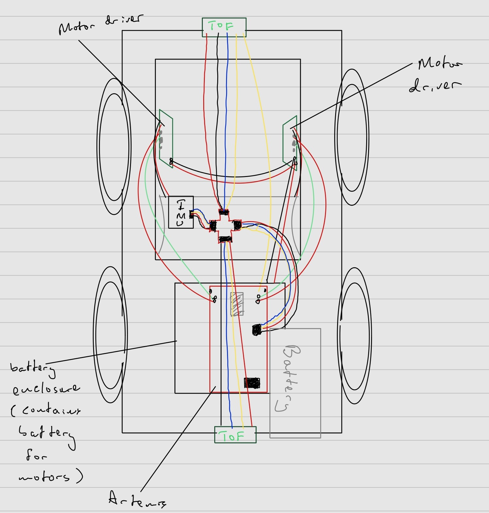

I decided to keep the connector we initially had for our RC car and then connect that to the Vin and GND pins on the motor drivers. This allowed us to connect the 3.7V battery to the motors and remove it for things like charging. This is mainly because the battery needed for the motors was different from the one needed for the Artemis.

To set up the motor drivers to  be able to pick up the PWM signals we send from the Artemis, we need to ensure that the pins we use to connect them allow such signals to be transmitted in the first place. Using the documentation for the Redboard Nano to locate the pins that allowed PWM signals, I decided to use pins 6, 7, 11, and 12 for my motors.

### Setup
For this lab, we opened up the RC car, took out the motherboard and left connections in the chassis, and then replaced them with our motor driver connections. For all the tests we needed we would use an oscilloscope, a power supply,  our RC car with the Artemis connected, and the method by which we upload our code( a laptop in  my case. The image below shows the general setup I used: 

### analogWrite
The analogWrite function was what would enable us to send PWM signals to the motor driver for the selective wheels to rotate either clockwise or anticlockwise. The first parameter of the function would highlight which pin on the Artemis the driver is connected to. And since each pin had its selective direction, we could also use these to indicate the direction of the car. Let's say clockwise is forward and anticlockwise is backward in my implementation. Forward pins are pin 6 and pin 11. Backward pins are pin 7 and pin 12. Using the code below:

dependent on what motorPin1 was set to, the pair of wheels on either side would rotate. If motorPin1 was equal to 7 then the wheels on the left side of the RC car would move  it "backwards".

### Oscilloscope Test
To test that the PWM signals were being generated properly, we used the oscilloscope to visualize it. I used a DC power supply of about 3.73V and 0.004A to simulate the signals we would get when the oscillator clip was connected to the output of the motor driver.

*One Motor Connected*

Using the Arduino example analogWrite, I enabled pin 7 and then saw as the oscilloscope picked up the waveform.

*Waveform of PWM signal*

Below is a video of the selected pin motors rotating.

*Note: Will take you to the video itself*

### Final Product
 Once I had ensured that both motor drivers worked correctly, minimized the wiring exposure to mitigate the problem of the wires snagging on the wheels when they rotated. The top image shows the motors soldered to their respective wiring. The bottom image shows 
 

*Motors Visible*

*Motors not visible*

### PWM and Calibration
The lowest value my analogWrite function would take for the wheels to generate motion was around 40 - 50. 60 seems to be the threshold for which the wheels would rotate at a quick pace and sync up after a small delay

So to account for this slight delay, I decided to start the wheels that had a delay first, then start the second set of wheels after about 2 seconds ( which seemed to be the average delay between the two)

Below is a video showing the RC car moving in a straight line for about 10-11 tiles. Each tile represents about 1-foot-by-1-foot, so we can assume that the RC car traveled a distance of at least 10 feet before going off-axis. 

*Note: Will take you to the video itself*

There still need to be further tweaks if I want the RC car to continuously run in a straight line.

# Lab 5: PID Control: Linear PID control and Linear interpolation
### Objective
The objective of this lab was to implement a PID controller that would be used to allow the car to avoid obstacles. The implementation of this we used was to stop the car at a set distance of 200mm from a wall autonomously.

***

### Prelab
For this lab, we had to implement a handler that would store all the data we would need to analyze for our PID controller. We would run a function that would initiate the PID controller and then store that data in arrays. We would later plot these values and make conclusions of suitable values for the parameters needed in our PID controller.

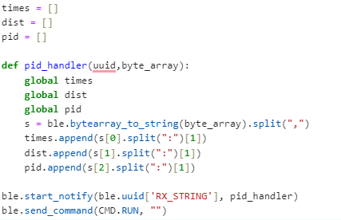

***

### PI Implementation
I planned to use a full PID implementation for my controller, but the best results I achieved were with the PI controller. The formula below gives a rough idea of how it would be calculated with e being the error(target- actual distance)

I used this formula to construct my PID.
I made a new function PID() that would take a target distance as an input. I gave this function a parameter in case we ever wanted to change our target distance. 
I initialized the timer count and first tested to see how much time would pass to gain each calculation of the PID later implemented in the function and found that the range was mostly between 0.01 and 0.02 ms. So I decided to hardcode the change in time to a constant value of 0.01 if there were any times dt was recorded as 0 ( a random error) since it was the most frequent dt value( this was mostly done to avoid a nan error when calculating the PID whenever dt was calculated to be 0).
I would then initiate the TOF sensor to start recording distances, only when there was data present and then save it in the variable 'distance'. This would be the actual distance between the wall and the front of the RC car where I place my TOF sensor.
The error was just the difference between the actual distance and the target distance and the signs were accounted for and would be further used in the PID calculation. 
I decided to split the PID calculation into three parts to make it easier to test each part: The proportional aspect(P), the Integral(I), and the derivative(D). I implemented each part to their respective implementations in the formula shown earlier.

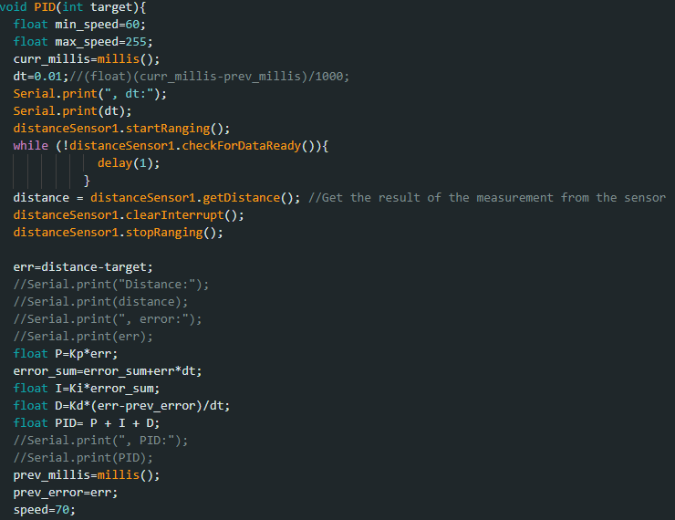

I implemented if statements that would execute the necessary behaviors in the car concerning the PID values. If positive( meaning that the car is further away than the target distance), then move forward at a decreasing amount of speed=PID( and forward was linked to certain pins so we initialized those pins). If negative, the car moves backward instead( so we initialized the backward pins instead) at a speed=-PID(since PID values would be negative if there is an overshoot). I realized I would encounter movement errors if the car didn't stop before the pins were switched so, I incorporated that into my if statement too.
I also accounted for if the PID was set to 0. This would mean that the error would be 0 and hence the car should come to a stop at that distance. I also accounted for if the speed was past the limit whether positive or negative and set them to an upper limit of 255

***

### Test Runs and Data Extracted
To test my implementation, I created a new case statement that would call PID() (with a target distance of 300mm) for a set number of seconds ( where val is our timer in a sense).

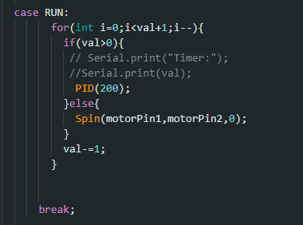

This command would be called by Python and would run the trials and give us the data we need to analyze.

***

#### P controller
For my tests, I decided to first start with finding the appropriate Kp value. This would mean to only change Kp and keep Ki and Kd constant at 0. I tested multiple values from 0.1 to 0.3 and below is a video of a run when Kp=0.3 and its associated graph, as well as graphs of Kp=0.15, 0.1, 0.11, and 0.12. All these trials were tested within 1110-1200mm from the wall( or pillow in the video case)

*Trial run 1. Kp=0.3*

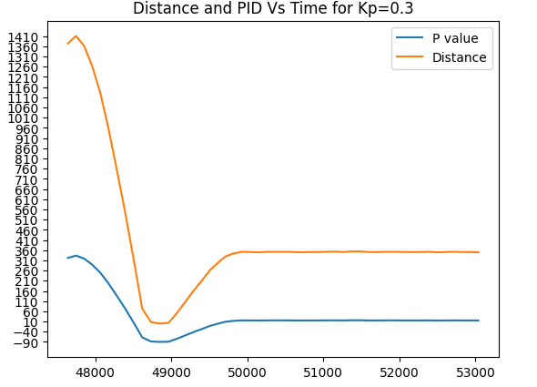

***

*Trial run 2. Kp=0.15*

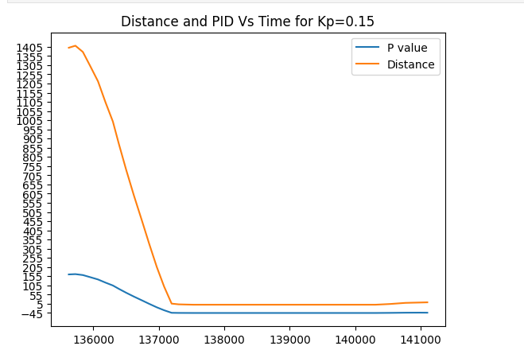

***

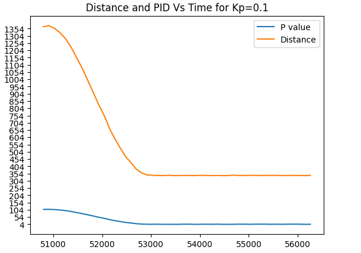 

*Note: Car stops at about 340mm*

***

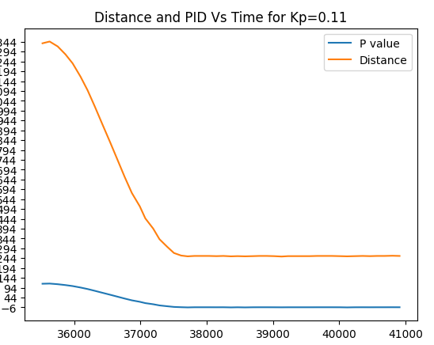

***

*Trial run 3. Kp=0.12*

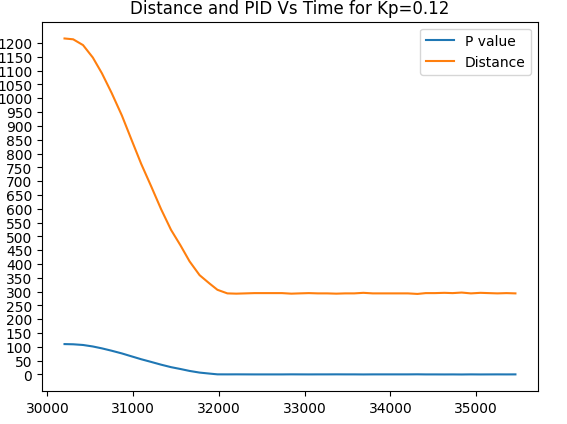

*Note: Car stops at about 295-315 mm(fluctuates with each run)*

***

#### PI controller
Since my car was very close to stopping at a good distance relative to the target I decided to incorporate the integral part of the PID to sort out the minor miscalculations. Below are the test runs and graphs for some of these Ki values:

*Trial run 4. Ki=0.0.0004*

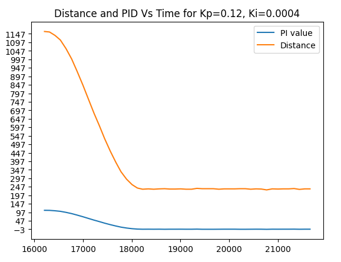 

***

*Trial run 5. Ki=0.0003*

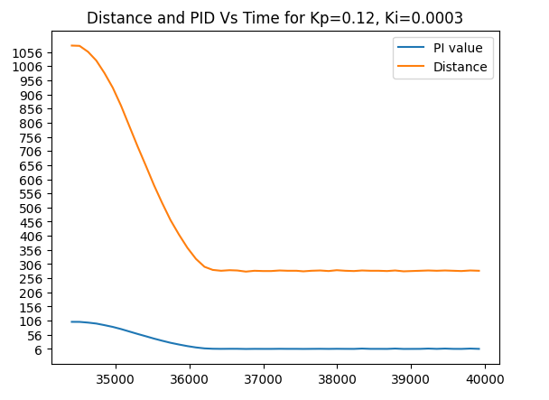 

*Note: Car stops at 294mm*

***

*Trial run 6. Ki=-0.0002*

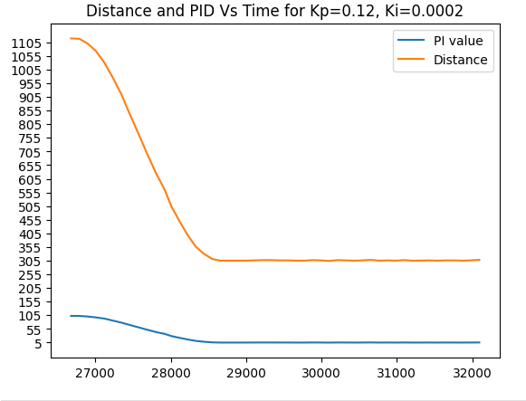

*Note: Car stops around 304-307mm)

I had observed that with Kp=0.12 and Ki=0.0002, I had become sparingly close to my set target distance of 300mm and I could decide to incorporate the D aspect of the PID to resolve this minor issue.

# Lab 6: Orientation PID control 
### Objective
The objective of this lab is to implement a PID controller that corrects the orientation of our RC car in response to an orientation change/shift using the IMU.

### P implementation
Similar to the implementation of the linear PID controller, my primary objective was to implement a P controller that would control the yaw of the robot in response to a certain error obtained by subtracting the current angle from the desired angle (0 degrees in this case). The controller would then respond by alternating wheel rotations in a certain direction (left or right) to decrease this error to zero. Once the error equates to zero the robot stops moving.

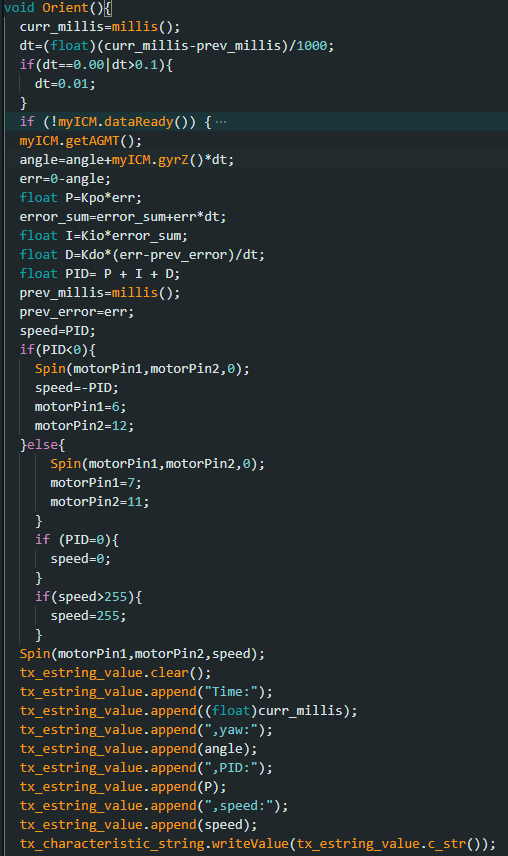

* Arduino Implementation *

Since I would need a different set of K values for this controller I instantiated a new set of Kp, Ki, and Kd values, and then set them all to 0 as seen below. To test I would change the Kpo variable's value and observe the results.

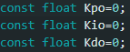

* K values *

Though not as present, there were some instances where dt would be considerably large on the first instantiation of the robot, so to account for this I put a cap on what dt could be considered. This made sure our Yaw values did not drift to extreme instances.

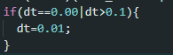

* Dt error fix *  

# P controller
To implement the controller, I decided to only change the Kpo variable and leave the others at zero.
I first tested with multiples of 5 and then would center around a margin if one of the Kp values was closer to the desired results.
Below are my trials for different KP values
For the trial with a KP value of 5, small changes in orientation would make the robot try to compete against them, but with a slight overshoot over time. I also observed that when done from a different direction, the controller in a sense"shuts off" and didn't do anything about the orientation change.

*Trial run 1. Kp=5*

Once I reached Kp=10 as a value, I observed that my controller had followed the desired angles at a decent rate.

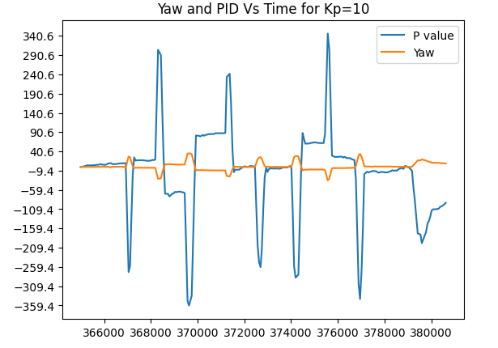

*Trial run 2. Kp=10*

I decided to test at a Kp value of 20 to see if my controller would improve or deviate from the desired results. It indeed deviated by a large margin. 

*Trial run 3. Kp=20*

I decided to get back to the values between 5 and 10 since I had achieved decent results around them. These are the trials of Kp = 6. Kp=7 and Kp=8.

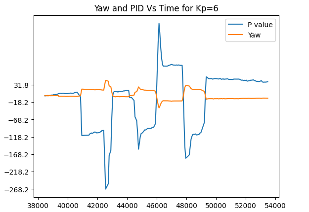

*Trial run 4. Kp=6*

*Trial run 5. Kp=7*

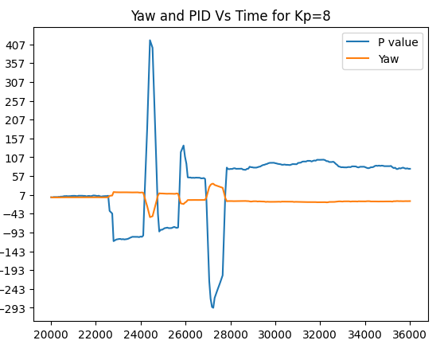

*Trial run 6 Kp=8*

I had concluded that a Kp of 10 would have been my best estimate, but you will see however that on random runs with kp=10, there were times when the controller deviated heavily from the desired point as shown below:

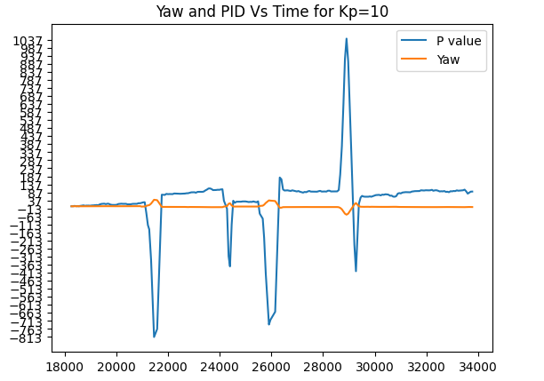

*Trial run 7, Take 2. Kp=10 *

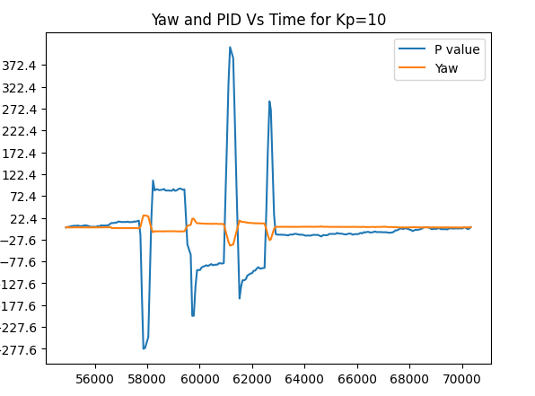

*Trial run 8, Take 3 . Kp=10 *

However, these random runs seem to be a rare occurrence to each other, because when I tried to replicate them again, I found no such issues. I believe they were however derived from less transfer of power to the battery or the next needed calibration of the motors in the clockwise/anticlockwise direction. Hence using my value of Kp=10, I had a decent controller without having to worry about too much drift, for a large number of angles.

# Lab 7: Kalman Filter 
### Objective
Since our RC car moves faster than the rate of sampling for our TOF sensors, the task of this lab was to implement Kalman filters to predict the location of the car and execute the necessary behaviors  much faster.

### Kalman Filter
To first implement our Kalman filter, the first issue was to calculate our drag and momentum. These 2 values were necessary for our calculations.

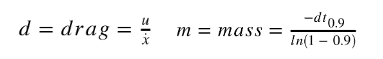

By running our robot at a constant PWM value and then calculating both the velocity and its distance it is possible to get the needed values. To do this I first plotted these values against time on a graph and then calculated d and m.

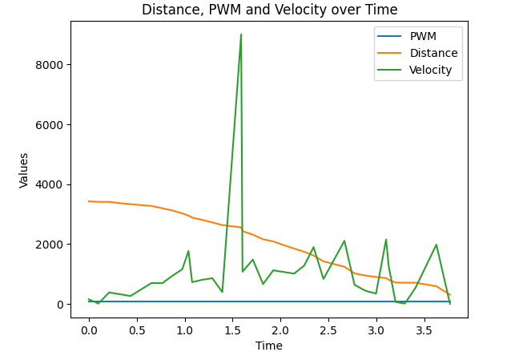

To calculate the drag(d) I first had to find the steady-state speed of our RC car. I did that by picking a part of the velocity array that didn't have extreme outliers and then finding the average speed( about 1230m/s). 
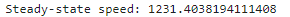

Assuming u=1, our drag was 1/average speed. For mass(m) we have to find the change in time for our 90% rise time and slot that into the equation above. To find the rise time, I first found out what 90% of my average speed entailed and then traced it on the graph.

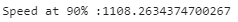

I found out that my rise time was about 0.9 seconds. The values for d and m are below:

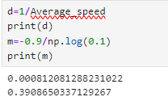

Using these values we can find our A and B matrices using:

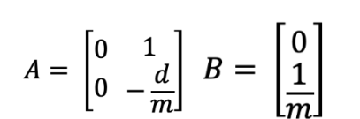

the C matrix was also given to us:

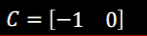

Once we have obtained our A and B matrices, we can discretize them and instantiate our sigma values for use in the implementation of the Kalman Filter.

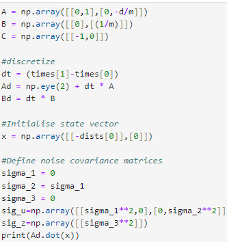

Below is the code that was provided to run the Kalman Filter:

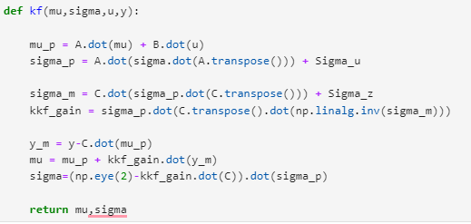

### Testing the Kalman Filter
The first test went pretty well. The filter followed the distance pretty closely until it was nearing the end with a much more noticeable drift:

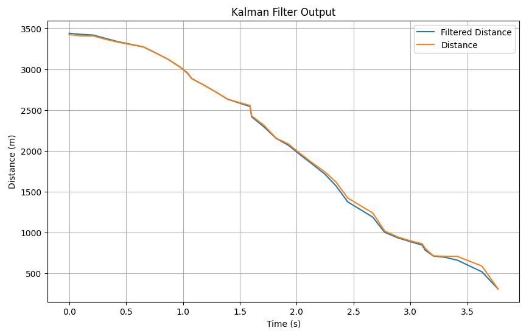

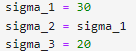

***

The second test how follows tightly only for a few seconds before the noticeable drift:
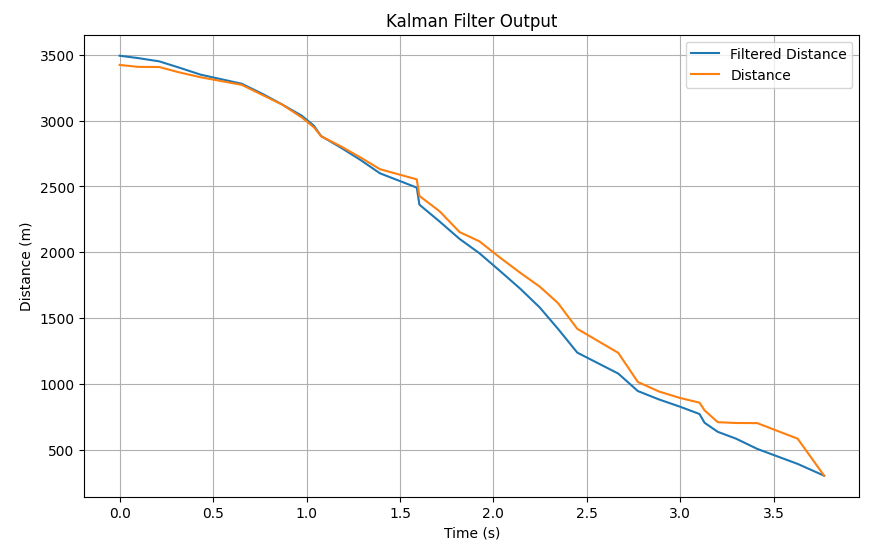

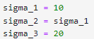

***

I decided to test the case where sigma 3 was a large value( highlighting a major skepticism to our sensor values). This causes a large gap between our actual distance values and the filtered distance:

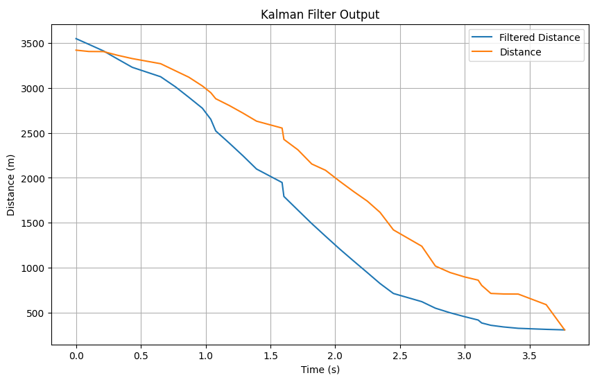

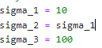

***

I decided to decrease sigma 3 for the next two tests and make sigma 1=sigma 2=40.
I observed that for a sigma 3 of 10, the filtered data followed tightly with the actual data and could give consensus that they were approximately the same:

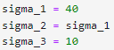

***

By decreasing sigma 3 further by 5, I observed that the filter derived a perfect fit to the actual data which was the best result:
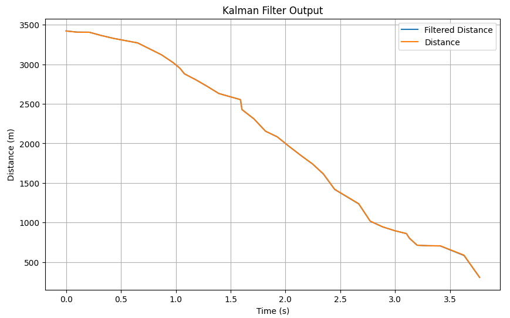

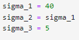

# Lab 8: STUNTS!
### Objective
The goal of this lab was for our RC car to perform a certain action when it approached a set distance from the wall( whether by turning around or by doing a flip)

### Implementation 
I decided to take on Task B: Orientation control, which entailed the car doing a turn upon reaching a set distance from the wall (300mm) and then back to the starting line. the best possible outcome would be for our robot to race to the wall as fast as possible, turn around, and then back to the finishing line as fast as possible. i had also tried my hands on Task A but issues arose and i couldn't replicate my results so i switched tasks.

### Trial 1

*180 in orient function. Turn but not fast enough*

### Trial 2

*Best result.  190 turn in Orient function*

### Trial 3

*200 degree turn, Overestimate*

### Trial 4

*195 degree turn slight overestimate, leading to continuous turns when within distance*

# Lab 9: Mapping

